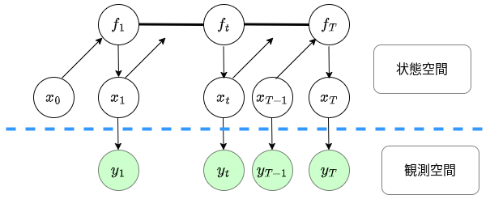

初項：2024年x月x日

<h3 align="center">為替予測モデル作成の試み PartⅠ  Gaussian Process State Space Model</h3>

藤原　哉

##### 概要

為替変動がランダムウォークと区別できないという事実は、広く認識されている。為替変動に限らず市場変数の予測モデルを作成する試みは、現代の「錬金術の探求」に似ていて虚しいものなのかもしれない。だが、錬金術の研究が現代の化学の礎を築いたように、収益を追求するための予測モデルの開発が、時系列モデルや市場変数の変動に対する深い理解をもたらす可能性がある。その可能性を引き出すためには、真剣な努力が不可欠である。

本メモは、以前は予測モデルに対して懐疑的だった筆者が、全力を尽くして予測モデルの開発に取り組んだ結果をまとめたものである。筆者の全能力を投じたこの試みは、新たな視点を提供し、未知の領域への扉を開くことを目指している。

#### 1. 為替変動のモデル化

##### 1-1. マクロ経済学での為替変動モデル

##### 1-2. ファイナンスでの為替変動モデル

##### 1-3. 予測のための為替変動モデルの提案

#### 2. GPSSMによる時系列モデルの構築と推定

##### 2-1. GPSSMによる時系列モデル：一般論

観測される量を $\{y_t\}_{t=1,\cdots,T}, \ y_t \in \mathbb{R}^{d_y}$とする。
$y_t$の変動を状態空間モデルで表現する。
$$
\begin{align*}
x_t &= f(x_{t-1}) + \nu_t, \ \nu_t \sim \mathscr{N}(0,\bf{Q}) \ \\
y_t &= C x_t + \varepsilon_t, \ \varepsilon_t \sim \mathscr{N}(0,\bf{R})
\end{align*}
$$ 
ただし、$x_t \in \mathbb{R}^{d_x}$, $C \in \mathbb{R}^{d_y \times d_x}, \ f:\mathbb{R}^{d_x} \rightarrow \mathbb{R}^{d_x}$である。
$f$がガウス過程に従うとして以下のようなガウス過程状態空間モデル（Gaussian Process State Space Model:GPSSM）を用いる。
$$
\begin{align*}
f(\cdot) &\sim \mathcal{GP}\left(\mu(\cdot), k(\cdot,\cdot); \theta_{gp} \right) \\
x_0 &\sim p(x_0) \\
f_t &= f(x_{t-1}) \\
x_t \vert f_t &\sim \mathcal{N}(x_t \vert f_t, \bf{Q}) \\
y_t \vert x_t &\sim \mathcal{N}(y_t \vert x_t, \bf{R})
\end{align*}
$$
$f(\cdot) = \{f_1(\cdot),\cdots,f_i,\cdots f_{d_x}(\cdot) \}$であり、各$f_i$が独立にガウス過程に従うと仮定することが典型的である。

このモデル化のグラフィカルモデルは図１のようになる。

図１：ガウス過程状態空間モデルのグラフィカルモデル

##### 2-2. 近似によるGPSSMの推定方法

#### 3. GPSSMによる為替予測モデル

##### 3-1. 予測に用いる変数

##### 3-2. 実装方法

#### 4. 実証結果

##### 4-1. 前提条件

##### 4-2. 推定結果

##### 4-3. トレーディング収益
これは文献[^2]に基づいています。

#### 5. まとめ
これは文献[^1]に基づく情報です。

#### 参考文献

[^1]: 参考文献1の詳細
[^2]: 参考文献2の詳細
[^3]: 参考文献3の詳細